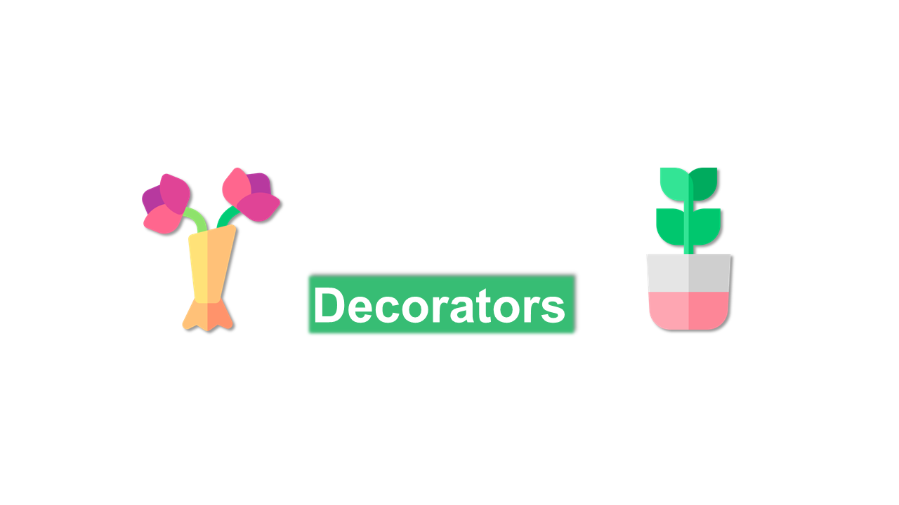

# Python Decorators

&nbsp;

### Decorators are a special case of closures where you use functions to wrap the execution to other functions

&nbsp;

&nbsp;

:rewind: [Back to Main Menu](https://github.com/kumar1987an/Python_Sept2021_Tutorials/blob/root/README.md)
