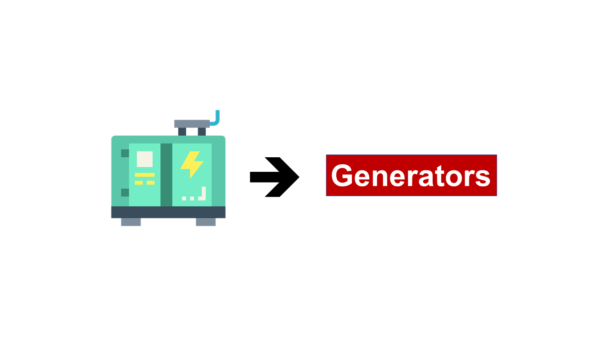

# Python Generators

&nbsp;

### Generator are a special kind of function that return a lazy iterator. These are objects that you can loop over like a list. However, unlike lists, lazy iterators do not store their contents in memory.

&nbsp;

&nbsp;

:rewind: [Back to Main Menu](https://github.com/kumar1987an/Python_Sept2021_Tutorials/blob/root/README.md)
