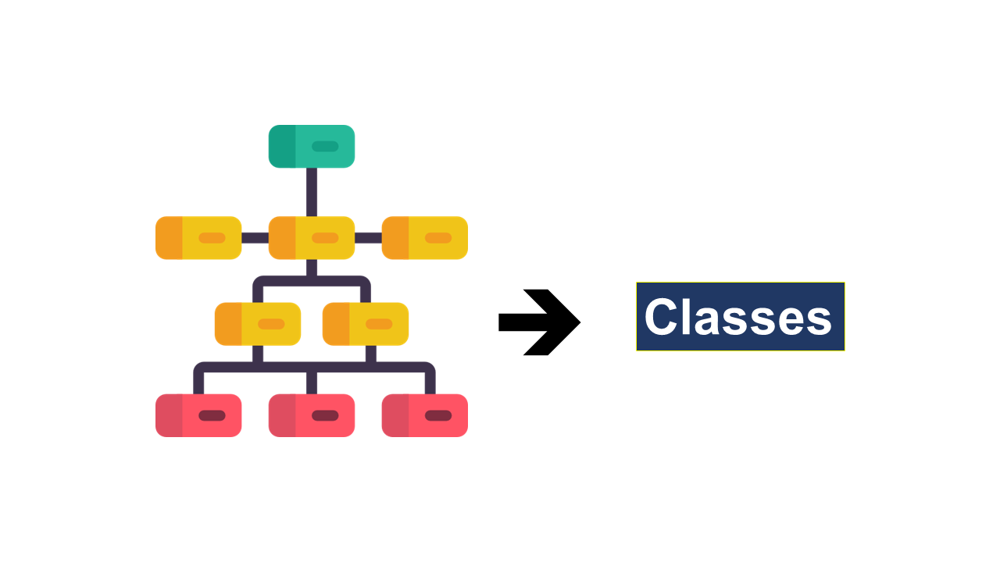

# Python Classes

&nbsp;

### A class is a blueprint to play around with the objects and methods to define the data and its construct.

&nbsp;

&nbsp;

:rewind: [Back to Main Menu](https://github.com/kumar1987an/Python_Sept2021_Tutorials/blob/root/README.md)
