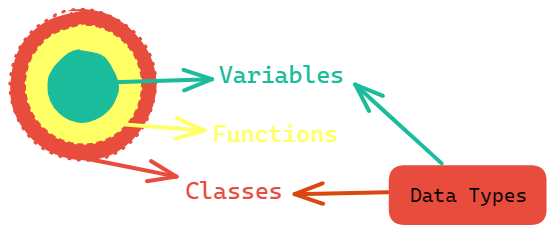

# Python Objects

&nbsp;

#### ***In Python everything will be considered as objects***

&nbsp;

&nbsp;

:rewind: [Back to Main Menu](https://github.com/kumar1987an/Python_Sept2021_Tutorials/blob/root/README.md)
